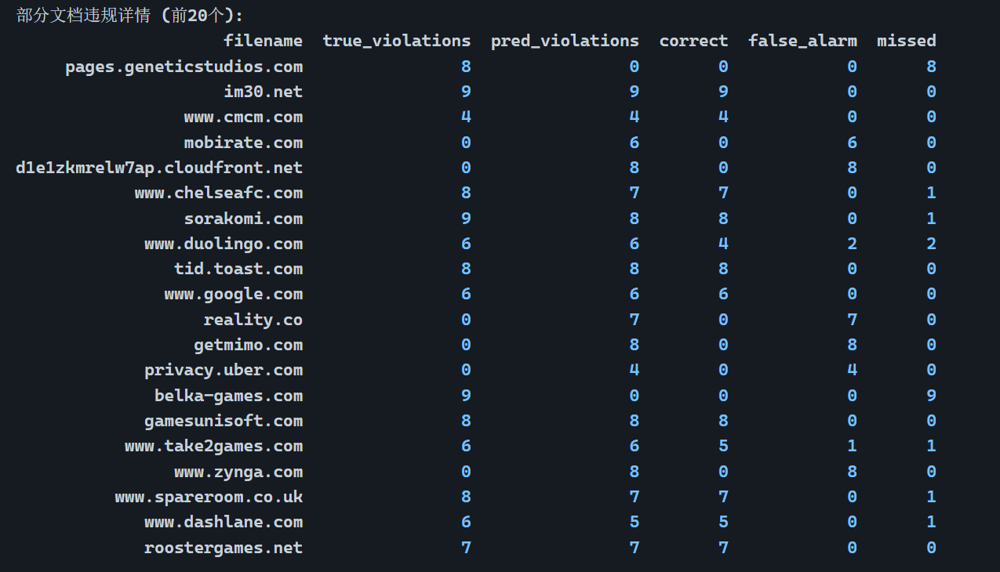

## 数据集解析


### 1.从GDPR#13提取10项规则集

规则集：General Data Protection Regulation (GDPR)，基于第 13 条内容人工提取出 10 个标签。

1. 收集个人信息（Collect Personal Information）：收集可识别数据主体身份的个人标识信息。[GDPR 第 13.1 条]
2. 数据留存期限（Data Retention Period）：个人信息的留存时长。[GDPR 第 13.2（a）条]
3. 数据处理目的（Data Processing Purposes）：处理个人数据的目的。[GDPR 第 13.1（c）条]
4. 联系方式（Contact Details）：数据控制者或数据保护官的联系方式。[GDPR 第 13.1（a）（b）条]
5. 访问权（Right to Access）：数据主体有权向控制者请求访问其个人信息。[GDPR 第 13.2（b）条]
6. 更正或删除权（Right to Rectify or Erase）：数据主体有权向控制者请求更正或删除其个人信息。[GDPR 第 13.2（b）条]
7. 限制处理权（Right to Restrict of Processing）：数据主体有权向控制者请求限制与自身相关的数据处理。[GDPR 第 13.2（b）条]
8. 反对处理权（Right to Object to Processing）：数据主体有权向控制者请求反对数据处理。[GDPR 第 13.2（b）条]
9. 数据可携带权（Right to Data Portability）：数据主体有权接收其个人数据并将其传输给另一数据控制者。[GDPR 第 13.2（b）条]
10. 投诉权（Right to Lodge a Complaint）：数据主体有权向监管机构提起投诉。[GDPR 第 13.2（d）条]

### 2.数据集标注

之后研究人员从 304 份隐私政策中人工构建了包含 36610 个带标签句子的语料库，并采用多种标准句子分类模型对该语料库进行性能验证。此外，还通过基于规则的分析检测合规性问题，并开展用户研究评估该方法的可用性。


表 2：标注语料库分类统计

| 标签                | 频次   | 覆盖率（%） | 平均词数（Avg.W） | [弗莱希斯卡帕系数](https://www.doubao.com/thread/w271f26692219d4a8) |
| ------------------- | ------ | ----------- | ----------------- | ------------------------------------------------------------ |
| 收集个人信息（CPI） | 1,542  | 94.41       | 31.61             | 0.45                                                         |
| 数据留存期限（DRP） | 448    | 61.51       | 30.50             | 0.45                                                         |
| 数据处理目的（DPP） | 1,839  | 93.75       | 25.76             | 0.51                                                         |
| 联系方式（CD）      | 721    | 85.20       | 24.13             | 0.47                                                         |
| 访问权（RA）        | 115    | 29.28       | 25.32             | 0.47                                                         |
| 更正或删除权（RRE） | 562    | 70.07       | 23.61             | 0.49                                                         |
| 限制处理权（RRP）   | 127    | 29.28       | 23.03             | 0.51                                                         |
| 反对处理权（ROP）   | 245    | 40.46       | 23.24             | 0.47                                                         |
| 数据可携带权（RDP） | 167    | 35.53       | 26.30             | 0.57                                                         |
| 投诉权（RLC）       | 145    | 36.84       | 24.77             | 0.57                                                         |
| 其他（Other）       | 30,699 | 100.00      | 24.98             |                                                              |


### 3.当前工作目录信息

```
E:.
│  1.md
│  countLabel.py
│  www2021autocompliance.pdf
│  www2021autocompliance_翻译版.pdf
│  初稿101800.docx
│  
├─assets
│      image-20251026131416682.png
│      
└─dataset
        data.tsv
```


数据集data.tsv是以下`tsv`文件格式

```tsx
label	sentence	filename
0	Frans Erenstraat 14A 	www.idates.com
0	Support requests via compliance @ as well as email attachments will not be opened/considered due to security regulations . 	www.idates.com
0	Questions Related to Data Protection and Exercising your Rights 	www.idates.com
。。。。。。。。。。。。(省略数万行)
```


### 4.标签映射

#### 文本分类阶段

Label and its corresponding number:
0: Other
1: Collect Personal Information
2: Data Retention Period
3: Data Processing Purposes
4: Contact Details
5: Right to Access
6: Right to Rectify or Erase
7: Right to Restrict of Processing
8: Right to Object to Processing
9: Right to Data Portability
10: Right to Lodge a Complaint

| labelid | label               |
| ------- | ------------------- |
| 0       | 其他（Other）       |
| 1       | 收集个人信息（CPI） |
| 2       | 数据留存期限（DRP） |
| 3       | 数据处理目的（DPP） |
| 4       | 联系方式（CD）      |
| 5       | 访问权（RA）        |
| 6       | 更正或删除权（RRE） |
| 7       | 限制处理权（RRP）   |
| 8       | 反对处理权（ROP）   |
| 9       | 数据可携带权（RDP） |
| 10      | 投诉权（RLC）       |


#### 合规检测阶段

只要CollectPersonalInfo（收集个人信息）的表述存在，就必须同时包含这 9 条规则(Table4)对应的所有信息，否则即判定为违反 GDPR 第 13 条的合规性问题。


Table4：合规分析规则（Compliance Analysis Rules）

| 规则编号 | 规则                                                |
| -------- | --------------------------------------------------- |
| 1        | `CollectPersonalInfo → DataRetentionPeriod`         |
| 2        | `CollectPersonalInfo → DataProcessingPurposes`      |
| 3        | `CollectPersonalInfo → ContactDetails`              |
| 4        | `CollectPersonalInfo → RighttoAccess`               |
| 5        | `CollectPersonalInfo → RighttoRectifyorErase`       |
| 6        | `CollectPersonalInfo → RighttoRestrictofProcessing` |
| 7        | `CollectPersonalInfo → RighttoObjecttoProcessing`   |
| 8        | `CollectPersonalInfo → RighttoDataPortability`      |
| 9        | `CollectPersonalInfo → RighttoLodgeaComplaint`      |


## 实验方法

### 实验目的

任务分为两个阶段：

形式化上，Liu等人的工作旨在自动化检测包含N个句子的隐私政策文档$\mathcal{D}={s_1,s_2,\ldots,s_N}$是否符合GDPR第13条的要求。任务分为两个阶段：句子分类和基于规则的合规分析。在句子分类阶段，首先构建一个标签集合 $\mathcal{L}={\ell_1,\ell_2,\ldots,\ell_{10}}$，对应GDPR第13条要求的10类声明。该阶段的目标是训练一个模型 $f:s_i\rightarrow\ell\in\mathcal{L}$，将每个句子$s_i$分类到相应的声明类型$\ell$。在基于规则的合规分析阶段，手动构建一个规则集$\mathcal{R}={r_j|r_j:A\rightarrow B}$，包含9条规则，其中A和B均为标签集合$\mathcal{L}$中的元素。若在文档$\mathcal{D}$中出现A标签而缺少B标签，即 $A\land\lnot B$，则判定该文档存在违规

### 分类方法

对于句子分类任务，采用十折交叉验证方法：将整个语料库平均分为 10 份，每次验证时以其中 8 份作为训练集、1 份作为验证集、1 份作为测试集。评估指标采用标准的精确率（P）、召回率（R）和 F1 分数（F）。

| 方法                         | 实现方式                                                     |
| ---------------------------- | ------------------------------------------------------------ |
| 支持向量机SVM                | 支持向量机（SVM）模型基于 SciKit-learn 0.22 工具包实现，采用线性核函数； |
| 双向长短期记忆网络（BiLSTM） | BiLSTM 和 BERT 等神经网络分类模型基于 Pytorch深度学习框架实现。其中，BiLSTM 模型采用 Glove [24] 词嵌入作为输入向量，向量维度设为 100； |
| BERT 模型                    | BERT 模型采用谷歌发布的 BERT 基础版无大小写区分模型（BERT-Base, Uncased）[10]。神经网络模型采用小批量在线学习（批大小设为 4），优化算法选用 Adam，BiLSTM 和 BERT 的初始学习率分别设为 2e-4 和 5e-5。最大训练轮次设为 16，选择在验证集上性能最优的模型作为最终模型。 |


## 实验结果


### 文本分类阶段

#### 指标

Precision（精确率）：公式：TP / (TP + FP)
含义：模型预测为违规的结果中，真正违规的比例（衡量 “少误报” 能力）。
Recall（召回率）：公式：TP / (TP + FN)
含义：实际存在的违规中，被模型成功检测到的比例（衡量 “少漏检” 能力）。
F1-Score：公式：2 * Precision * Recall / (Precision + Recall)
含义：精确率和召回率的调和平均，综合评估模型的整体检测性能（取值范围 0-1，越接近 1 越好）。


#### GDPR Classification Results (Precision / Recall / F1)

| Category          | **SVM P** | **SVM R** | **SVM F** | **BiLSTM P** | **BiLSTM R** | **BiLSTM F** | **BiLSTM+LW P** | **BiLSTM+LW R** | **BiLSTM+LW F** | **BERT P** | **BERT R** | **BERT F** | **BERT+LW P** | **BERT+LW R** | **BERT+LW F** |
| ----------------- | --------- | --------- | --------- | ------------ | ------------ | ------------ | --------------- | --------------- | --------------- | ---------- | ---------- | ---------- | ------------- | ------------- | ------------- |
| *CPI*             | 65.95     | 39.61     | 49.49     | 59.92        | 46.10        | 52.11        | 58.02           | 49.35           | 53.33           | 55.84      | 57.47      | 56.64      | **63.18**     | 49.03         | 55.21         |
| *DRP*             | 75.76     | 55.56     | 64.10     | 67.11        | 56.67        | 61.45        | 62.50           | 61.11           | 61.80           | 69.51      | 63.33      | 66.28      | 65.62         | **70.00**     | 67.74         |
| *DPP*             | 70.48     | 43.48     | 53.78     | 70.00        | 49.46        | 57.96        | 68.20           | 44.29           | 53.71           | 69.08      | 57.07      | 62.50      | 60.48         | 61.96         | 61.21         |
| *CD*              | 78.50     | 58.33     | 66.93     | 80.49        | 68.75        | 74.16        | 74.13           | 73.61           | 73.87           | 79.86      | 77.08      | 78.45      | 78.68         | 74.31         | 76.43         |
| *RA*              | 82.35     | 60.87     | 70.00     | 71.43        | 21.74        | 33.33        | 58.62           | 73.91           | 65.38           | 72.73      | 69.57      | 71.11      | 52.78         | **82.61**     | 64.41         |
| *RRE*             | 78.31     | 57.52     | 66.33     | 60.63        | 68.14        | 64.17        | 68.47           | 67.26           | 67.86           | 80.21      | 68.14      | 73.68      | 77.19         | 77.88         | 77.53         |
| *RRP*             | 90.00     | 72.00     | 80.00     | 56.41        | **88.00**    | 68.75        | 46.81           | 88.00           | 61.11           | 46.00      | 92.00      | 61.33      | 74.19         | **92.00**     | **82.14**     |
| *ROP*             | 79.41     | 55.10     | 65.06     | 89.29        | 51.02        | 64.94        | 82.35           | 57.14           | 67.47           | 78.95      | 61.22      | 68.97      | 80.56         | 59.18         | 68.24         |
| *RDP*             | 88.00     | 66.67     | 75.86     | 68.75        | 66.67        | 67.69        | 85.19           | 69.70           | 76.67           | **95.83**  | 69.70      | **80.70**  | 88.89         | 72.73         | 80.00         |
| *RLC*             | 72.73     | 82.76     | 77.42     | 75.76        | 86.21        | 80.65        | 61.54           | 82.76           | 70.59           | 50.00      | 96.55      | 65.88      | 62.22         | 96.55         | 75.68         |
| **Avg (10 tags)** | **78.15** | 59.19     | 66.90     | 69.98        | 60.28        | 62.52        | 66.58           | 66.71           | 65.18           | 69.80      | 71.21      | 68.55      | **70.38**     | **73.62**     | **70.86**     |
| *Other*           | 91.39     | 97.12     | 94.17     | 92.42        | 95.73        | 94.05        | 92.40           | 94.85           | 93.61           | 93.62      | 94.45      | 94.03      | **93.71**     | 94.40         | **94.05**     |


### 合规检测阶段

#### 指标

- 真实违规总数：所有文档中实际违反合规规则的总次数；
- 预测违规总数：模型预测的违反合规规则的总次数；
- 正确检测（TP）：模型预测为违规，且实际确实违规的次数；
- 误报（FP）：模型预测为违规，但实际未违规的次数；
- 漏检（FN）：实际存在违规，但模型未预测到的次数。

#### GDPR Compliance Analysis Results

```bash
=====================================================
合规性检测评估
=====================================================

总共 301 个隐私政策文档

合规性统计:
  真实违规总数: 1070
  预测违规总数: 992
  正确检测 (TP): 736
  误报 (FP): 256
  漏检 (FN): 334

合规性检测性能:
  Precision: 0.7419
  Recall: 0.6879
  F1-Score: 0.7139


====================================================
```




```bash


====================================================
实验总结
====================================================

分类性能 (10个GDPR标签平均):
  SVM             - P: 0.7815, R: 0.5919, F1: 0.6690
  BiLSTM          - P: 0.6998, R: 0.6028, F1: 0.6252
  BiLSTM+LW       - P: 0.6658, R: 0.6671, F1: 0.6518
  BERT            - P: 0.6980, R: 0.7121, F1: 0.6855
  BERT+LW         - P: 0.7038, R: 0.7362, F1: 0.7086

合规性检测性能:
  Precision: 0.7419
  Recall: 0.6879
  F1-Score: 0.7139

=====================================================
实验完成！
=====================================================
```


终端输出

```bash
(compliance) h3c@h3c-H3C-UniServer-R4900-G501:/home/sunjingyun/ykx_workdir/nlp/privacyPolitice$ python ./GdprComplianceExperiment.py 
============================================================
GDPR Article 13 隐私政策合规性分析实验 (修复版)
============================================================
加载数据: ./dataset/data.tsv
数据集大小: 36610

标签分布:
  0 (Other): 30699
  1 (Collect Personal Information (CPI)): 1542
  2 (Data Retention Period (DRP)): 448
  3 (Data Processing Purposes (DPP)): 1839
  4 (Contact Details (CD)): 721
  5 (Right to Access (RA)): 115
  6 (Right to Rectify or Erase (RRE)): 562
  7 (Right to Restrict of Processing (RRP)): 127
  8 (Right to Object to Processing (ROP)): 245
  9 (Right to Data Portability (RDP)): 167
  10 (Right to Lodge a Complaint (RLC)): 145

文件数量: 302

类别权重:
  Other: 0.1248
  Collect Personal Information (CPI): 0.5386
  Data Retention Period (DRP): 1.2476
  Data Processing Purposes (DPP): 0.4516
  Contact Details (CD): 1.1518
  Right to Access (RA): 1.2476
  Right to Rectify or Erase (RRE): 1.2476
  Right to Restrict of Processing (RRP): 1.2476
  Right to Object to Processing (ROP): 1.2476
  Right to Data Portability (RDP): 1.2476
  Right to Lodge a Complaint (RLC): 1.2476

数据划分:
  训练集: 25627
  验证集: 3661
  测试集: 7322

============================================================
训练 SVM...
============================================================

============================================================
SVM 评估结果
============================================================
                                Label Precision Recall F1-Score  Support
                                Other    0.9139 0.9712   0.9417     6140
   Collect Personal Information (CPI)    0.6595 0.3961   0.4949      308
          Data Retention Period (DRP)    0.7576 0.5556   0.6410       90
       Data Processing Purposes (DPP)    0.7048 0.4348   0.5378      368
                 Contact Details (CD)    0.7850 0.5833   0.6693      144
                 Right to Access (RA)    0.8235 0.6087   0.7000       23
      Right to Rectify or Erase (RRE)    0.7831 0.5752   0.6633      113
Right to Restrict of Processing (RRP)    0.9000 0.7200   0.8000       25
  Right to Object to Processing (ROP)    0.7941 0.5510   0.6506       49
      Right to Data Portability (RDP)    0.8800 0.6667   0.7586       33
     Right to Lodge a Complaint (RLC)    0.7273 0.8276   0.7742       29

============================================================
10个GDPR标签的平均指标:
Precision: 0.7815
Recall: 0.5919
F1-Score: 0.6690
============================================================


============================================================
训练 BiLSTM...
============================================================
  Epoch 1/10 - Train Loss: 0.6859, Val Loss: 0.4932
  Epoch 2/10 - Train Loss: 0.4711, Val Loss: 0.4565
  Epoch 3/10 - Train Loss: 0.4060, Val Loss: 0.3952
  Epoch 4/10 - Train Loss: 0.3592, Val Loss: 0.3961
  Epoch 5/10 - Train Loss: 0.3271, Val Loss: 0.4090
  Epoch 6/10 - Train Loss: 0.2994, Val Loss: 0.3959
  Early stopping at epoch 6

============================================================
BiLSTM 评估结果
============================================================
                                Label Precision Recall F1-Score  Support
                                Other    0.9134 0.9720   0.9418     6140
   Collect Personal Information (CPI)    0.6684 0.4188   0.5150      308
          Data Retention Period (DRP)    0.7000 0.5444   0.6125       90
       Data Processing Purposes (DPP)    0.7198 0.4049   0.5183      368
                 Contact Details (CD)    0.8131 0.6042   0.6932      144
                 Right to Access (RA)    0.8667 0.5652   0.6842       23
      Right to Rectify or Erase (RRE)    0.7927 0.5752   0.6667      113
Right to Restrict of Processing (RRP)    0.7586 0.8800   0.8148       25
  Right to Object to Processing (ROP)    1.0000 0.5510   0.7105       49
      Right to Data Portability (RDP)    0.9167 0.6667   0.7719       33
     Right to Lodge a Complaint (RLC)    0.7647 0.8966   0.8254       29

============================================================
10个GDPR标签的平均指标:
Precision: 0.8001
Recall: 0.6107
F1-Score: 0.6813
============================================================


============================================================
训练 BiLSTM+LW (Loss Weighting)...
============================================================
  Epoch 1/10 - Train Loss: 1.4096, Val Loss: 0.9917
  Epoch 2/10 - Train Loss: 0.9576, Val Loss: 0.8626
  Epoch 3/10 - Train Loss: 0.7958, Val Loss: 0.8168
  Epoch 4/10 - Train Loss: 0.6966, Val Loss: 0.7253
  Epoch 5/10 - Train Loss: 0.6231, Val Loss: 0.8057
  Epoch 6/10 - Train Loss: 0.5877, Val Loss: 0.7908
  Epoch 7/10 - Train Loss: 0.5312, Val Loss: 0.7904
  Early stopping at epoch 7

============================================================
BiLSTM+LW 评估结果
============================================================
                                Label Precision Recall F1-Score  Support
                                Other    0.9265 0.9500   0.9381     6140
   Collect Personal Information (CPI)    0.5316 0.5455   0.5385      308
          Data Retention Period (DRP)    0.5800 0.6444   0.6105       90
       Data Processing Purposes (DPP)    0.7758 0.4701   0.5854      368
                 Contact Details (CD)    0.7464 0.7153   0.7305      144
                 Right to Access (RA)    0.8000 0.5217   0.6316       23
      Right to Rectify or Erase (RRE)    0.6545 0.6372   0.6457      113
Right to Restrict of Processing (RRP)    0.7857 0.8800   0.8302       25
  Right to Object to Processing (ROP)    0.8286 0.5918   0.6905       49
      Right to Data Portability (RDP)    0.7692 0.6061   0.6780       33
     Right to Lodge a Complaint (RLC)    0.7714 0.9310   0.8438       29

============================================================
10个GDPR标签的平均指标:
Precision: 0.7243
Recall: 0.6543
F1-Score: 0.6785
============================================================


============================================================
训练 BERT...
============================================================
  Epoch 1/10 - Train Loss: 0.4700, Val Loss: 0.3377
  Epoch 2/10 - Train Loss: 0.3234, Val Loss: 0.3836
  Epoch 3/10 - Train Loss: 0.2641, Val Loss: 0.4680
  Epoch 4/10 - Train Loss: 0.2163, Val Loss: 0.4828
  Early stopping at epoch 4

============================================================
BERT 评估结果
============================================================
                                Label Precision Recall F1-Score  Support
                                Other    0.9222 0.9590   0.9402     6140
   Collect Personal Information (CPI)    0.6136 0.4383   0.5114      308
          Data Retention Period (DRP)    0.6761 0.5333   0.5963       90
       Data Processing Purposes (DPP)    0.7190 0.4728   0.5705      368
                 Contact Details (CD)    0.7161 0.7708   0.7425      144
                 Right to Access (RA)    0.7778 0.6087   0.6829       23
      Right to Rectify or Erase (RRE)    0.7700 0.6814   0.7230      113
Right to Restrict of Processing (RRP)    0.8148 0.8800   0.8462       25
  Right to Object to Processing (ROP)    0.7949 0.6327   0.7045       49
      Right to Data Portability (RDP)    0.7857 0.6667   0.7213       33
     Right to Lodge a Complaint (RLC)    0.7297 0.9310   0.8182       29

============================================================
10个GDPR标签的平均指标:
Precision: 0.7398
Recall: 0.6616
F1-Score: 0.6917
============================================================


============================================================
训练 BERT+LW (Loss Weighting)...
============================================================
  Epoch 1/10 - Train Loss: 0.9082, Val Loss: 0.8474
  Epoch 2/10 - Train Loss: 0.6123, Val Loss: 0.6667
  Epoch 3/10 - Train Loss: 0.4933, Val Loss: 0.9892
  Epoch 4/10 - Train Loss: 0.4066, Val Loss: 0.9718
  Epoch 5/10 - Train Loss: 0.3285, Val Loss: 1.1045
  Early stopping at epoch 5

============================================================
BERT+LW 评估结果
============================================================
                                Label Precision Recall F1-Score  Support
                                Other    0.9411 0.9368   0.9389     6140
   Collect Personal Information (CPI)    0.5611 0.5519   0.5565      308
          Data Retention Period (DRP)    0.6476 0.7556   0.6974       90
       Data Processing Purposes (DPP)    0.6433 0.5978   0.6197      368
                 Contact Details (CD)    0.7379 0.7431   0.7405      144
                 Right to Access (RA)    0.7143 0.6522   0.6818       23
      Right to Rectify or Erase (RRE)    0.7236 0.7876   0.7542      113
Right to Restrict of Processing (RRP)    0.5349 0.9200   0.6765       25
  Right to Object to Processing (ROP)    0.7083 0.6939   0.7010       49
      Right to Data Portability (RDP)    0.7778 0.8485   0.8116       33
     Right to Lodge a Complaint (RLC)    0.6364 0.9655   0.7671       29

============================================================
10个GDPR标签的平均指标:
Precision: 0.6685
Recall: 0.7516
F1-Score: 0.7006
============================================================


============================================================
所有模型的合规性检测评估
============================================================

--- SVM 合规性检测 ---

============================================================
合规性检测评估
============================================================

总共 301 个隐私政策文档

合规性统计:
  真实违规总数: 1070
  预测违规总数: 908
  正确检测 (TP): 652
  误报 (FP): 256
  漏检 (FN): 418

合规性检测性能:
  Precision: 0.7181
  Recall: 0.6093
  F1-Score: 0.6593

部分文档违规详情 (前20个):
                     filename  true_violations  pred_violations  correct  false_alarm  missed
     pages.geneticstudios.com                8                0        0            0       8
                     im30.net                9                9        9            0       0
                 www.cmcm.com                4                4        4            0       0
d1e1zkmrelw7ap.cloudfront.net                0                8        0            8       0
            www.chelseafc.com                8                8        8            0       0
                 sorakomi.com                9                0        0            0       9
             www.duolingo.com                6                7        5            2       1
                tid.toast.com                8                8        8            0       0
               www.google.com                6                0        0            0       6
                   reality.co                0                7        0            7       0
                  getmimo.com                0                8        0            8       0
              belka-games.com                9                0        0            0       9
             gamesunisoft.com                8                0        0            0       8
           www.take2games.com                6                6        5            1       1
                www.zynga.com                0                8        0            8       0
          www.spareroom.co.uk                8                8        8            0       0
             www.dashlane.com                6                6        5            1       1
             roostergames.net                7                8        7            1       0
              www.gamegos.com                9                0        0            0       9
                 gogolive.com                7                8        7            1       0

============================================================


--- BiLSTM 合规性检测 ---

============================================================
合规性检测评估
============================================================

总共 301 个隐私政策文档

合规性统计:
  真实违规总数: 1070
  预测违规总数: 970
  正确检测 (TP): 688
  误报 (FP): 282
  漏检 (FN): 382

合规性检测性能:
  Precision: 0.7093
  Recall: 0.6430
  F1-Score: 0.6745

部分文档违规详情 (前20个):
                     filename  true_violations  pred_violations  correct  false_alarm  missed
     pages.geneticstudios.com                8                0        0            0       8
                     im30.net                9                8        8            0       1
                 www.cmcm.com                4                4        4            0       0
d1e1zkmrelw7ap.cloudfront.net                0                8        0            8       0
            www.chelseafc.com                8                8        8            0       0
                 sorakomi.com                9                0        0            0       9
             www.duolingo.com                6                7        6            1       0
                tid.toast.com                8                8        8            0       0
               www.google.com                6                6        6            0       0
                   reality.co                0                7        0            7       0
                  getmimo.com                0                8        0            8       0
              belka-games.com                9                0        0            0       9
             gamesunisoft.com                8                0        0            0       8
           www.take2games.com                6                7        6            1       0
                www.zynga.com                0                6        0            6       0
          www.spareroom.co.uk                8                0        0            0       8
             www.dashlane.com                6                5        5            0       1
             roostergames.net                7                7        7            0       0
              www.gamegos.com                9                0        0            0       9
                 gogolive.com                7                8        7            1       0

============================================================


--- BiLSTM+LW 合规性检测 ---

============================================================
合规性检测评估
============================================================

总共 301 个隐私政策文档

合规性统计:
  真实违规总数: 1070
  预测违规总数: 1243
  正确检测 (TP): 783
  误报 (FP): 460
  漏检 (FN): 287

合规性检测性能:
  Precision: 0.6299
  Recall: 0.7318
  F1-Score: 0.6770

部分文档违规详情 (前20个):
                     filename  true_violations  pred_violations  correct  false_alarm  missed
     pages.geneticstudios.com                8                0        0            0       8
                     im30.net                9                9        9            0       0
                 www.cmcm.com                4                4        4            0       0
                 mobirate.com                0                6        0            6       0
d1e1zkmrelw7ap.cloudfront.net                0                8        0            8       0
            www.chelseafc.com                8                7        7            0       1
                 sorakomi.com                9                8        8            0       1
             www.duolingo.com                6                5        4            1       2
                tid.toast.com                8                8        8            0       0
               www.google.com                6                6        6            0       0
                   reality.co                0                6        0            6       0
                  getmimo.com                0                8        0            8       0
             privacy.uber.com                0                5        0            5       0
              belka-games.com                9                9        9            0       0
             gamesunisoft.com                8                8        8            0       0
           www.take2games.com                6                6        5            1       1
                www.zynga.com                0                9        0            9       0
          www.spareroom.co.uk                8                6        6            0       2
             www.dashlane.com                6                5        5            0       1
             roostergames.net                7                7        7            0       0

============================================================


--- BERT 合规性检测 ---

============================================================
合规性检测评估
============================================================

总共 301 个隐私政策文档

合规性统计:
  真实违规总数: 1070
  预测违规总数: 925
  正确检测 (TP): 691
  误报 (FP): 234
  漏检 (FN): 379

合规性检测性能:
  Precision: 0.7470
  Recall: 0.6458
  F1-Score: 0.6927

部分文档违规详情 (前20个):
                     filename  true_violations  pred_violations  correct  false_alarm  missed
     pages.geneticstudios.com                8                0        0            0       8
                     im30.net                9                8        8            0       1
                 www.cmcm.com                4                4        4            0       0
                 mobirate.com                0                6        0            6       0
     www.fungames-forfree.com                0                6        0            6       0
d1e1zkmrelw7ap.cloudfront.net                0                8        0            8       0
            www.chelseafc.com                8                8        8            0       0
                 sorakomi.com                9                8        8            0       1
             www.duolingo.com                6                7        5            2       1
                tid.toast.com                8                8        8            0       0
               www.google.com                6                5        5            0       1
                   reality.co                0                7        0            7       0
              belka-games.com                9                0        0            0       9
             gamesunisoft.com                8                0        0            0       8
           www.take2games.com                6                8        6            2       0
                www.zynga.com                0                8        0            8       0
          www.spareroom.co.uk                8                0        0            0       8
             www.dashlane.com                6                6        6            0       0
             roostergames.net                7                7        7            0       0
              www.gamegos.com                9                0        0            0       9

============================================================


--- BERT+LW 合规性检测 ---

============================================================
合规性检测评估
============================================================

总共 301 个隐私政策文档

合规性统计:
  真实违规总数: 1070
  预测违规总数: 1100
  正确检测 (TP): 780
  误报 (FP): 320
  漏检 (FN): 290

合规性检测性能:
  Precision: 0.7091
  Recall: 0.7290
  F1-Score: 0.7189

部分文档违规详情 (前20个):
                     filename  true_violations  pred_violations  correct  false_alarm  missed
     pages.geneticstudios.com                8                0        0            0       8
                     im30.net                9                9        9            0       0
                 www.cmcm.com                4                4        4            0       0
                 mobirate.com                0                6        0            6       0
d1e1zkmrelw7ap.cloudfront.net                0                8        0            8       0
            www.chelseafc.com                8                7        7            0       1
                 sorakomi.com                9                8        8            0       1
             www.duolingo.com                6                7        6            1       0
                tid.toast.com                8                8        8            0       0
               www.google.com                6                5        5            0       1
                   reality.co                0                8        0            8       0
              belka-games.com                9                9        9            0       0
             gamesunisoft.com                8                8        8            0       0
           www.take2games.com                6                6        6            0       0
                www.zynga.com                0                7        0            7       0
          www.spareroom.co.uk                8                5        5            0       3
             www.dashlane.com                6                5        5            0       1
             roostergames.net                7                6        6            0       1
              www.gamegos.com                9                0        0            0       9
               lionstudios.cc                0                4        0            4       0

============================================================


============================================================
实验总结
============================================================

分类性能 (10个GDPR标签平均):
  SVM             - P: 0.7815, R: 0.5919, F1: 0.6690
  BiLSTM          - P: 0.8001, R: 0.6107, F1: 0.6813
  BiLSTM+LW       - P: 0.7243, R: 0.6543, F1: 0.6785
  BERT            - P: 0.7398, R: 0.6616, F1: 0.6917
  BERT+LW         - P: 0.6685, R: 0.7516, F1: 0.7006

合规性检测性能 (所有模型):

Model           Precision    Recall       F1-Score    
---------------------------------------------------
SVM             0.7181       0.6093       0.6593      
BiLSTM          0.7093       0.6430       0.6745      
BiLSTM+LW       0.6299       0.7318       0.6770      
BERT            0.7470       0.6458       0.6927      
BERT+LW         0.7091       0.7290       0.7189      

============================================================
实验完成！
============================================================
```


