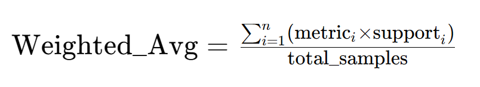

## 实验方法

### 隐马尔可夫模型（Hidden Markov Model，HMM）


隐马尔可夫模型描述由一个隐藏的马尔科夫链随机生成不可观测的状态随机序列，再由各个状态生成一个观测而产生观测随机序列的过程（李航 统计学习方法）。隐马尔可夫模型由初始状态分布，状态转移概率矩阵以及观测概率矩阵所确定。

命名实体识别本质上可以看成是一种序列标注问题，在使用HMM解决命名实体识别这种序列标注问题的时候，我们所能观测到的是字组成的序列（观测序列），观测不到的是每个字对应的标注（状态序列）。

**初始状态分布**就是每一个标注的初始化概率，**状态转移概率矩阵**就是由某一个标注转移到下一个标注的概率（就是若前一个词的标注为$tag_i$ ，则下一个词的标注为$tag_j$的概率为 Mij），**观测概率矩阵**就是指在

某个标注下，生成某个词的概率。

HMM模型的训练过程对应隐马尔可夫模型的学习问题（李航 统计学习方法），

实际上就是根据训练数据根据最大似然的方法估计模型的三个要素，即上文提到的初始状态分布、状态转移概率矩阵以及观测概率矩阵，模型训练完毕之后，利用模型进行解码，即对给定观测序列，求它对应的状态序列，这里就是对给定的句子，求句子中的每个字对应的标注，针对这个解码问题，我们使用的是维特比（viterbi）算法。

具体的细节可以查看 `models/hmm.py`文件。

### 条件随机场（Conditional Random Field, CRF)


HMM模型中存在两个假设，一是输出观察值之间严格独立，二是状态转移过程中当前状态只与前一状态有关。也就是说，在命名实体识别的场景下，HMM认为观测到的句子中的每个字都是相互独立的，而且当前时刻的标注只与前一时刻的标注相关。但实际上，命名实体识别往往需要更多的特征，比如词性，词的上下文等等，同时当前时刻的标注应该与前一时刻以及后一时刻的标注都相关联。由于这两个假设的存在，显然HMM模型在解决命名实体识别的问题上是存在缺陷的。

条件随机场通过引入自定义的特征函数，不仅可以表达观测之间的依赖，还可表示当前观测与前后多个状态之间的复杂依赖，可以有效克服HMM模型面临的问题。

为了建立一个条件随机场，我们首先要定义一个特征函数集，该函数集内的每个特征函数都以标注序列作为输入，提取的特征作为输出。假设该函数集为：

[](https://github.com/luopeixiang/named_entity_recognition/blob/master/imgs/func_set.png)

其中$x=(x_1, ..., x_m)$表示观测序列，$s = (s_1, ...., s_m)$表示状态序列。然后，条件随机场使用对数线性模型来计算给定观测序列下状态序列的条件概率：

[](https://github.com/luopeixiang/named_entity_recognition/blob/master/imgs/log_linear_crf.png)

其中$s^{'}$是是所有可能的状态序列，$w$是条件随机场模型的参数，可以把它看成是每个特征函数的权重。CRF模型的训练其实就是对参数$w$的估计。假设我们有$n$个已经标注好的数据${(x^i, s^i)}_{i=1}^n$，

则其对数似然函数的正则化形式如下：

[](https://github.com/luopeixiang/named_entity_recognition/blob/master/imgs/log_likehood_crf.png)

那么，最优参数$w^*$就是：

[](https://github.com/luopeixiang/named_entity_recognition/blob/master/imgs/w_crf.png)

模型训练结束之后，对给定的观测序列$x$，它对应的最优状态序列应该是：

[](https://github.com/luopeixiang/named_entity_recognition/blob/master/imgs/decode_crf.png)

解码的时候与HMM类似，也可以采用维特比算法。

具体的细节可以查看 `models/crf.py`文件。

### Bi-LSTM


除了以上两种基于概率图模型的方法，LSTM也常常被用来解决序列标注问题。和HMM、CRF不同的是，LSTM是依靠神经网络超强的非线性拟合能力，在训练时将样本通过高维空间中的复杂非线性变换，学习到从样本到标注的函数，之后使用这个函数为指定的样本预测每个token的标注。下方就是使用双向LSTM（双向能够更好的捕捉序列之间的依赖关系）进行序列标注的示意图：

[](https://github.com/luopeixiang/named_entity_recognition/blob/master/imgs/biLSTM_NER.png)

基于双向LSTM的序列标注模型实现可以查看`models/bilstm.py`文件。

### Bi-LSTM+CRF


LSTM的优点是能够通过双向的设置学习到观测序列（输入的字）之间的依赖，在训练过程中，LSTM能够根据目标（比如识别实体）自动提取观测序列的特征，但是缺点是无法学习到状态序列（输出的标注）之间的关系，要知道，在命名实体识别任务中，标注之间是有一定的关系的，比如B类标注（表示某实体的开头）后面不会再接一个B类标注，所以LSTM在解决NER这类序列标注任务时，虽然可以省去很繁杂的特征工程，但是也存在无法学习到标注上下文的缺点。

相反，CRF的优点就是能对隐含状态建模，学习状态序列的特点，但它的缺点是需要手动提取序列特征。所以一般的做法是，在LSTM后面再加一层CRF，以获得两者的优点。

具体的实现请查看`models/bilstm_crf.py`


### BERT


## 运行结果

下面是四种不同的模型以及这Ensemble这四个模型预测结果的准确率（取最好）：

|        | HMM    | CRF    | BiLSTM | BiLSTM+CRF | Ensemble |
| ------ | ------ | ------ | ------ | ---------- | -------- |
| 召回率 | 91.22% | 95.43% | 95.32% | 95.72%     | 95.65%   |
| 准确率 | 91.49% | 95.43% | 95.37% | 95.74%     | 95.69%   |
| F1分数 | 91.30% | 95.42% | 95.32% | 95.70%     | 95.64%   |

最后一列Ensemble是将这四个模型的预测结果结合起来，使用“投票表决”的方法得出最后的预测结果。

（Ensemble的三个指标均不如BiLSTM+CRF，可以认为在Ensemble过程中，是其他三个模型拖累了BiLSTM+CRF）

具体的输出可以查看`output.txt`文件。


其中输出的P、R、F既不是宏平均也不是微平均，而是依据各个标签的样本数量进行的加权平均。


现象分析

| 模型       | P     | R     | F1    |
| ---------- | ----- | ----- | ----- |
| BiLSTM     | 64.74 | 63.64 | 57.51 |
| BiLSTM+CRF | 61.56 | 62.84 | 61.54 |

F1先对每个标签单独计算 F1，再加权平均。所以出现了P、R都低但是F1却高的现象。




## 代码中一些需要注意的点

* HMM模型中要处理OOV(Out of vocabulary)的问题，就是测试集里面有些字是不在训练集里面的，
  这个时候通过观测概率矩阵是无法查询到OOV对应的各种状态的概率的，处理这个问题可以将OOV对应的状态的概率分布设为均匀分布。
* HMM的三个参数（即状态转移概率矩阵、观测概率矩阵以及初始状态概率矩阵）在使用监督学习方法进行估计的过程中，如果有些项从未出现，那么该项对应的位置就为0，而在使用维特比算法进行解码的时候，计算过程需要将这些值相乘，那么如果其中有为0的项，那么整条路径的概率也变成0了。此外，解码过程中多个小概率相乘很可能出现下溢的情况，为了解决这两个问题，我们给那些从未出现过的项赋予一个很小的数(如0.00000001)，同时在进行解码的时候将模型的三个参数都映射到对数空间，这样既可以避免下溢，又可以简化乘法运算。
* CRF中将训练数据以及测试数据作为模型的输入之前，都需要先用特征函数提取特征！
* Bi-LSTM+CRF模型可以参考：[Neural Architectures for Named Entity Recognition](https://arxiv.org/pdf/1603.01360.pdf)，可以重点看一下里面的损失函数的定义。代码里面关于损失函数的计算采用的是类似动态规划的方法，不是很好理解，这里推荐看一下以下这些博客：

  * [CRF Layer on the Top of BiLSTM - 5](https://createmomo.github.io/2017/11/11/CRF-Layer-on-the-Top-of-BiLSTM-5/)
  * [Bi-LSTM-CRF for Sequence Labeling PENG](https://zhuanlan.zhihu.com/p/27338210) 
  * [Pytorch Bi-LSTM + CRF 代码详解](https://blog.csdn.net/cuihuijun1hao/article/details/79405740)


## TODO

* BI-LSTM+CRF 比起Bi-LSTM效果并没有好很多，一种可能的解释是：
  - 数据集太小，不足够让模型学习到转移矩阵（后续尝试在更大的数据集上测试一下结果）
* 尝试更加复杂的模型，参考论文[Chinese NER using Lattice LSTM](https://github.com/jiesutd/LatticeLSTM)
* 更详细的评估结果：打印混淆矩阵，同时输出每种类别的召回率、准确率、F1指标，便于分析。


## 运行结果

下面是四种不同的模型以及这Ensemble这四个模型预测结果的准确率（取最好）：

|        | HMM    | CRF    | BiLSTM | BiLSTM+CRF | Ensemble |
| ------ | ------ | ------ | ------ | ---------- | -------- |
| 召回率 | 91.22% | 95.43% | 95.32% | 95.72%     | 95.65%   |
| 准确率 | 91.49% | 95.43% | 95.37% | 95.74%     | 95.69%   |
| F1分数 | 91.30% | 95.42% | 95.32% | 95.70%     | 95.64%   |

最后一列Ensemble是将这四个模型的预测结果结合起来，使用“投票表决”的方法得出最后的预测结果。

（Ensemble的三个指标均不如BiLSTM+CRF，可以认为在Ensemble过程中，是其他三个模型拖累了BiLSTM+CRF）

具体的输出可以查看`output.txt`文件。


## 代码中一些需要注意的点

  * HMM模型中要处理OOV(Out of vocabulary)的问题，就是测试集里面有些字是不在训练集里面的，
    这个时候通过观测概率矩阵是无法查询到OOV对应的各种状态的概率的，处理这个问题可以将OOV对应的状态的概率分布设为均匀分布。
  * HMM的三个参数（即状态转移概率矩阵、观测概率矩阵以及初始状态概率矩阵）在使用监督学习方法进行估计的过程中，如果有些项从未出现，那么该项对应的位置就为0，而在使用维特比算法进行解码的时候，计算过程需要将这些值相乘，那么如果其中有为0的项，那么整条路径的概率也变成0了。此外，解码过程中多个小概率相乘很可能出现下溢的情况，为了解决这两个问题，我们给那些从未出现过的项赋予一个很小的数(如0.00000001)，同时在进行解码的时候将模型的三个参数都映射到对数空间，这样既可以避免下溢，又可以简化乘法运算。
  * CRF中将训练数据以及测试数据作为模型的输入之前，都需要先用特征函数提取特征！
  * Bi-LSTM+CRF模型可以参考：[Neural Architectures for Named Entity Recognition](https://arxiv.org/pdf/1603.01360.pdf)，可以重点看一下里面的损失函数的定义。代码里面关于损失函数的计算采用的是类似动态规划的方法，不是很好理解，这里推荐看一下以下这些博客：

    * [CRF Layer on the Top of BiLSTM - 5](https://createmomo.github.io/2017/11/11/CRF-Layer-on-the-Top-of-BiLSTM-5/)
    * [Bi-LSTM-CRF for Sequence Labeling PENG](https://zhuanlan.zhihu.com/p/27338210) 
    * [Pytorch Bi-LSTM + CRF 代码详解](https://blog.csdn.net/cuihuijun1hao/article/details/79405740)

  

## TODO

  * BI-LSTM+CRF 比起Bi-LSTM效果并没有好很多，一种可能的解释是：
    - 数据集太小，不足够让模型学习到转移矩阵（后续尝试在更大的数据集上测试一下结果）
  * 尝试更加复杂的模型，参考论文[Chinese NER using Lattice LSTM](https://github.com/jiesutd/LatticeLSTM)
  * 更详细的评估结果：打印混淆矩阵，同时输出每种类别的召回率、准确率、F1指标，便于分析。


## 实验结果

```

================================================================================
步骤1: 读取所有NER标注数据
================================================================================
开始遍历根目录：E:\education\深度学习与数据分析\深度学习\NLP\complianceCheck\work_directory\5.1.2 命名实体识别\隐私协议人工标注语料库-NER模型训练数据

读取完成: 785 个文件，11993 个句子

================================================================================
步骤2: 统计所有数据中的实体类型
================================================================================
所有数据实体统计:
  Artifical: 2942 个
  TARGET: 1494 个
  总计: 4436 个实体

================================================================================
步骤3: 划分训练集/验证集/测试集
================================================================================
数据集划分:
  训练集: 8395 句 (70.0%)
  验证集: 1798 句 (15.0%)
  测试集: 1800 句 (15.0%)

================================================================================
步骤4: 统计各数据集的实体分布
================================================================================
训练集: {'TARGET': 1055, 'Artifical': 2100}
验证集: {'Artifical': 414, 'TARGET': 222}
测试集: {'Artifical': 428, 'TARGET': 217}

================================================================================
步骤5: 构建词表和标签表
================================================================================
词表大小: 1595
标签数量: 8
标签列表: ['O', 'B-TARGET', 'M-TARGET', 'E-TARGET', 'B-Artifical', 'M-Artifical', 'E-Artifical', 'S-TARGET']

================================================================================
步骤6: 训练和评估模型
================================================================================

正在训练评估HMM模型...
           precision    recall  f1-score   support
        O     0.7600    0.4777    0.5866     76133
B-Artifical     0.2307    0.5164    0.3189       428
 M-TARGET     0.4227    0.5512    0.4785     20201
 S-TARGET     0.0000    0.0000    0.0000         1
 E-TARGET     0.2764    0.3519    0.3096       216
M-Artifical     0.4524    0.7137    0.5538     36380
E-Artifical     0.2553    0.5327    0.3452       428
 B-TARGET     0.2559    0.3519    0.2963       216
avg/total     0.6207    0.5527    0.5588    134003

Confusion Matrix:
              O B-Artifical M-TARGET S-TARGET E-TARGET M-Artifical E-Artifical B-TARGET 
      O   36365     505   12243       0     150   26281     435     154 
B-Artifical     132     221       2       0       0      55       0      18 
M-TARGET    3907      34   11135       0      25    5024      40      36 
S-TARGET       1       0       0       0       0       0       0       0 
E-TARGET      66       0      28       0      76       8      38       0 
M-Artifical    7180     152    2910       0      10   25963     152      13 
E-Artifical     129       0       9       0      14      48     228       0 
B-TARGET      71      46      17       0       0       6       0      76 

正在训练评估CRF模型...
           precision    recall  f1-score   support
        O     0.6735    0.6970    0.6850     76133
B-Artifical     0.4881    0.4299    0.4571       428
 M-TARGET     0.4374    0.3736    0.4030     20201
 S-TARGET     0.0000    0.0000    0.0000         1
 E-TARGET     0.2965    0.2361    0.2629       216
M-Artifical     0.4964    0.5029    0.4996     36380
E-Artifical     0.4282    0.3832    0.4044       428
 B-TARGET     0.3846    0.3009    0.3377       216
avg/total     0.5874    0.5923    0.5893    134003

Confusion Matrix:
              O B-Artifical M-TARGET S-TARGET E-TARGET M-Artifical E-Artifical B-TARGET 
      O   53061     150    8024       0      97   14556     167      78 
B-Artifical     185     184       1       0       0      40       0      18 
M-TARGET    8730       2    7548       0       7    3907       1       6 
S-TARGET       1       0       0       0       0       0       0       0 
E-TARGET     102       1      23       0      51       2      37       0 
M-Artifical   16409       6    1648       0       4   18297      14       2 
E-Artifical     193       0       4       0      13      54     164       0 
B-TARGET     103      34      10       0       0       4       0      65 

正在训练评估双向LSTM模型...
Epoch 1, step/total_step: 5/132 3.79% Loss:2.0249
Epoch 1, step/total_step: 10/132 7.58% Loss:1.1444
Epoch 1, step/total_step: 15/132 11.36% Loss:1.0788
Epoch 1, step/total_step: 20/132 15.15% Loss:1.1447
Epoch 1, step/total_step: 25/132 18.94% Loss:1.0768
Epoch 1, step/total_step: 30/132 22.73% Loss:1.0112
Epoch 1, step/total_step: 35/132 26.52% Loss:1.0974
Epoch 1, step/total_step: 40/132 30.30% Loss:1.0339
Epoch 1, step/total_step: 45/132 34.09% Loss:1.0765
Epoch 1, step/total_step: 50/132 37.88% Loss:1.0605
Epoch 1, step/total_step: 55/132 41.67% Loss:0.9689
Epoch 1, step/total_step: 60/132 45.45% Loss:0.9521
Epoch 1, step/total_step: 65/132 49.24% Loss:0.9457
Epoch 1, step/total_step: 70/132 53.03% Loss:0.7974
Epoch 1, step/total_step: 75/132 56.82% Loss:0.7474
Epoch 1, step/total_step: 80/132 60.61% Loss:0.7225
Epoch 1, step/total_step: 85/132 64.39% Loss:0.5782
Epoch 1, step/total_step: 90/132 68.18% Loss:0.3913
Epoch 1, step/total_step: 95/132 71.97% Loss:0.4282
Epoch 1, step/total_step: 100/132 75.76% Loss:0.3274
Epoch 1, step/total_step: 105/132 79.55% Loss:0.1569
Epoch 1, step/total_step: 110/132 83.33% Loss:0.2252
Epoch 1, step/total_step: 115/132 87.12% Loss:0.2166
Epoch 1, step/total_step: 120/132 90.91% Loss:0.1787
Epoch 1, step/total_step: 125/132 94.70% Loss:0.1494
Epoch 1, step/total_step: 130/132 98.48% Loss:0.1520
保存模型...
Epoch 1, Val Loss:2.3852
Epoch 2, step/total_step: 5/132 3.79% Loss:3.7047
Epoch 2, step/total_step: 10/132 7.58% Loss:1.4114
Epoch 2, step/total_step: 15/132 11.36% Loss:1.5140
Epoch 2, step/total_step: 20/132 15.15% Loss:1.1074
Epoch 2, step/total_step: 25/132 18.94% Loss:1.1029
Epoch 2, step/total_step: 30/132 22.73% Loss:0.9775
Epoch 2, step/total_step: 35/132 26.52% Loss:1.0732
Epoch 2, step/total_step: 40/132 30.30% Loss:1.0247
Epoch 2, step/total_step: 45/132 34.09% Loss:1.0483
Epoch 2, step/total_step: 50/132 37.88% Loss:1.0392
Epoch 2, step/total_step: 55/132 41.67% Loss:0.9404
Epoch 2, step/total_step: 60/132 45.45% Loss:0.9381
Epoch 2, step/total_step: 65/132 49.24% Loss:0.8900
Epoch 2, step/total_step: 70/132 53.03% Loss:0.7304
Epoch 2, step/total_step: 75/132 56.82% Loss:0.6687
Epoch 2, step/total_step: 80/132 60.61% Loss:0.6289
Epoch 2, step/total_step: 85/132 64.39% Loss:0.5000
Epoch 2, step/total_step: 90/132 68.18% Loss:0.3100
Epoch 2, step/total_step: 95/132 71.97% Loss:0.3153
Epoch 2, step/total_step: 100/132 75.76% Loss:0.2212
Epoch 2, step/total_step: 105/132 79.55% Loss:0.1120
Epoch 2, step/total_step: 110/132 83.33% Loss:0.1644
Epoch 2, step/total_step: 115/132 87.12% Loss:0.1493
Epoch 2, step/total_step: 120/132 90.91% Loss:0.1358
Epoch 2, step/total_step: 125/132 94.70% Loss:0.1197
Epoch 2, step/total_step: 130/132 98.48% Loss:0.1252
保存模型...
Epoch 2, Val Loss:1.6630
Epoch 3, step/total_step: 5/132 3.79% Loss:3.1081
Epoch 3, step/total_step: 10/132 7.58% Loss:1.2769
Epoch 3, step/total_step: 15/132 11.36% Loss:1.1576
Epoch 3, step/total_step: 20/132 15.15% Loss:1.0896
Epoch 3, step/total_step: 25/132 18.94% Loss:1.0385
Epoch 3, step/total_step: 30/132 22.73% Loss:0.9415
Epoch 3, step/total_step: 35/132 26.52% Loss:1.0493
Epoch 3, step/total_step: 40/132 30.30% Loss:0.9854
Epoch 3, step/total_step: 45/132 34.09% Loss:0.9957
Epoch 3, step/total_step: 50/132 37.88% Loss:0.9880
Epoch 3, step/total_step: 55/132 41.67% Loss:0.9051
Epoch 3, step/total_step: 60/132 45.45% Loss:0.8951
Epoch 3, step/total_step: 65/132 49.24% Loss:0.8488
Epoch 3, step/total_step: 70/132 53.03% Loss:0.6900
Epoch 3, step/total_step: 75/132 56.82% Loss:0.6157
Epoch 3, step/total_step: 80/132 60.61% Loss:0.5709
Epoch 3, step/total_step: 85/132 64.39% Loss:0.4779
Epoch 3, step/total_step: 90/132 68.18% Loss:0.2825
Epoch 3, step/total_step: 95/132 71.97% Loss:0.2875
Epoch 3, step/total_step: 100/132 75.76% Loss:0.2076
Epoch 3, step/total_step: 105/132 79.55% Loss:0.1127
Epoch 3, step/total_step: 110/132 83.33% Loss:0.1517
Epoch 3, step/total_step: 115/132 87.12% Loss:0.1219
Epoch 3, step/total_step: 120/132 90.91% Loss:0.1253
Epoch 3, step/total_step: 125/132 94.70% Loss:0.1067
Epoch 3, step/total_step: 130/132 98.48% Loss:0.1071
保存模型...
Epoch 3, Val Loss:1.3370
训练完毕,共用时23秒.
评估bilstm模型中...
           precision    recall  f1-score   support
        O     0.5696    0.9995    0.7257     76133
B-Artifical     0.7500    0.0210    0.0409       428
 M-TARGET     0.7059    0.0030    0.0059     20201
 S-TARGET     0.0000    0.0000    0.0000         1
 E-TARGET     0.0000    0.0000    0.0000       216
M-Artifical     0.6724    0.0054    0.0106     36380
E-Artifical     0.4615    0.0140    0.0272       428
 B-TARGET     0.2857    0.0093    0.0179       216
avg/total     0.6169    0.5699    0.4163    134003

Confusion Matrix:
              O B-Artifical M-TARGET S-TARGET E-TARGET M-Artifical E-Artifical B-TARGET 
      O   76096       0       2       0       1      32       1       1 
B-Artifical     414       9       0       0       0       2       0       3 
M-TARGET   20080       0      60       0       0      59       1       1 
S-TARGET       1       0       0       0       0       0       0       0 
E-TARGET     214       0       0       0       0       0       2       0 
M-Artifical   36160       0      22       0       0     195       3       0 
E-Artifical     421       0       1       0       0       0       6       0 
B-TARGET     209       3       0       0       0       2       0       2 

正在训练评估Bi-LSTM+CRF模型...
Epoch 1, step/total_step: 5/132 3.79% Loss:702.6745
Epoch 1, step/total_step: 10/132 7.58% Loss:265.2918
Epoch 1, step/total_step: 15/132 11.36% Loss:188.3611
Epoch 1, step/total_step: 20/132 15.15% Loss:168.7573
Epoch 1, step/total_step: 25/132 18.94% Loss:138.3265
Epoch 1, step/total_step: 30/132 22.73% Loss:118.1756
Epoch 1, step/total_step: 35/132 26.52% Loss:110.9422
Epoch 1, step/total_step: 40/132 30.30% Loss:94.3773
Epoch 1, step/total_step: 45/132 34.09% Loss:88.3906
Epoch 1, step/total_step: 50/132 37.88% Loss:76.3515
Epoch 1, step/total_step: 55/132 41.67% Loss:62.2124
Epoch 1, step/total_step: 60/132 45.45% Loss:53.1711
Epoch 1, step/total_step: 65/132 49.24% Loss:46.8172
Epoch 1, step/total_step: 70/132 53.03% Loss:33.8382
Epoch 1, step/total_step: 75/132 56.82% Loss:27.9669
Epoch 1, step/total_step: 80/132 60.61% Loss:22.8274
Epoch 1, step/total_step: 85/132 64.39% Loss:15.3279
Epoch 1, step/total_step: 90/132 68.18% Loss:9.4043
Epoch 1, step/total_step: 95/132 71.97% Loss:8.4965
Epoch 1, step/total_step: 100/132 75.76% Loss:5.4353
Epoch 1, step/total_step: 105/132 79.55% Loss:2.8416
Epoch 1, step/total_step: 110/132 83.33% Loss:2.9975
Epoch 1, step/total_step: 115/132 87.12% Loss:2.9629
Epoch 1, step/total_step: 120/132 90.91% Loss:2.1280
Epoch 1, step/total_step: 125/132 94.70% Loss:1.4384
Epoch 1, step/total_step: 130/132 98.48% Loss:1.3310
保存模型...
Epoch 1, Val Loss:122.0881
Epoch 2, step/total_step: 5/132 3.79% Loss:435.7253
Epoch 2, step/total_step: 10/132 7.58% Loss:273.8655
Epoch 2, step/total_step: 15/132 11.36% Loss:164.8156
Epoch 2, step/total_step: 20/132 15.15% Loss:138.0758
Epoch 2, step/total_step: 25/132 18.94% Loss:119.0228
Epoch 2, step/total_step: 30/132 22.73% Loss:93.8813
Epoch 2, step/total_step: 35/132 26.52% Loss:91.4578
Epoch 2, step/total_step: 40/132 30.30% Loss:75.6406
Epoch 2, step/total_step: 45/132 34.09% Loss:67.9003
Epoch 2, step/total_step: 50/132 37.88% Loss:59.5628
Epoch 2, step/total_step: 55/132 41.67% Loss:49.7946
Epoch 2, step/total_step: 60/132 45.45% Loss:42.0922
Epoch 2, step/total_step: 65/132 49.24% Loss:36.3484
Epoch 2, step/total_step: 70/132 53.03% Loss:27.0602
Epoch 2, step/total_step: 75/132 56.82% Loss:22.0564
Epoch 2, step/total_step: 80/132 60.61% Loss:18.0124
Epoch 2, step/total_step: 85/132 64.39% Loss:12.3887
Epoch 2, step/total_step: 90/132 68.18% Loss:7.9643
Epoch 2, step/total_step: 95/132 71.97% Loss:7.1341
Epoch 2, step/total_step: 100/132 75.76% Loss:4.8337
Epoch 2, step/total_step: 105/132 79.55% Loss:2.8311
Epoch 2, step/total_step: 110/132 83.33% Loss:2.7946
Epoch 2, step/total_step: 115/132 87.12% Loss:2.5496
Epoch 2, step/total_step: 120/132 90.91% Loss:1.9300
Epoch 2, step/total_step: 125/132 94.70% Loss:1.3629
Epoch 2, step/total_step: 130/132 98.48% Loss:1.1986
保存模型...
Epoch 2, Val Loss:64.4195
Epoch 3, step/total_step: 5/132 3.79% Loss:280.5616
Epoch 3, step/total_step: 10/132 7.58% Loss:160.1954
Epoch 3, step/total_step: 15/132 11.36% Loss:132.3838
Epoch 3, step/total_step: 20/132 15.15% Loss:100.9409
Epoch 3, step/total_step: 25/132 18.94% Loss:85.2323
Epoch 3, step/total_step: 30/132 22.73% Loss:68.2042
Epoch 3, step/total_step: 35/132 26.52% Loss:69.1359
Epoch 3, step/total_step: 40/132 30.30% Loss:57.7797
Epoch 3, step/total_step: 45/132 34.09% Loss:51.1183
Epoch 3, step/total_step: 50/132 37.88% Loss:43.0200
Epoch 3, step/total_step: 55/132 41.67% Loss:37.1046
Epoch 3, step/total_step: 60/132 45.45% Loss:32.1236
Epoch 3, step/total_step: 65/132 49.24% Loss:28.0159
Epoch 3, step/total_step: 70/132 53.03% Loss:20.5787
Epoch 3, step/total_step: 75/132 56.82% Loss:16.5139
Epoch 3, step/total_step: 80/132 60.61% Loss:13.6813
Epoch 3, step/total_step: 85/132 64.39% Loss:9.5547
Epoch 3, step/total_step: 90/132 68.18% Loss:6.1448
Epoch 3, step/total_step: 95/132 71.97% Loss:5.5725
Epoch 3, step/total_step: 100/132 75.76% Loss:3.8280
Epoch 3, step/total_step: 105/132 79.55% Loss:2.2215
Epoch 3, step/total_step: 110/132 83.33% Loss:2.2218
Epoch 3, step/total_step: 115/132 87.12% Loss:2.0083
Epoch 3, step/total_step: 120/132 90.91% Loss:1.5939
Epoch 3, step/total_step: 125/132 94.70% Loss:1.1746
Epoch 3, step/total_step: 130/132 98.48% Loss:1.0232
保存模型...
Epoch 3, Val Loss:45.3743
训练完毕,共用时43秒.
评估bilstm_crf模型中...
           precision    recall  f1-score   support
        O     0.5682    1.0000    0.7247     76133
B-Artifical     0.0000    0.0000    0.0000       428
 M-TARGET     0.0000    0.0000    0.0000     20201
 S-TARGET     0.0000    0.0000    0.0000         1
 E-TARGET     0.0000    0.0000    0.0000       216
M-Artifical     0.9091    0.0003    0.0005     36380
E-Artifical     1.0000    0.0047    0.0093       428
 B-TARGET     0.0000    0.0000    0.0000       216
avg/total     0.5728    0.5682    0.4119    134003

Confusion Matrix:
              O B-Artifical M-TARGET S-TARGET E-TARGET M-Artifical E-Artifical B-TARGET 
      O   76133       0       0       0       0       0       0       0 
B-Artifical     428       0       0       0       0       0       0       0 
M-TARGET   20201       0       0       0       0       0       0       0 
S-TARGET       1       0       0       0       0       0       0       0 
E-TARGET     216       0       0       0       0       0       0       0 
M-Artifical   36370       0       0       0       0      10       0       0 
E-Artifical     425       0       0       0       0       1       2       0 
B-TARGET     216       0       0       0       0       0       0       0 

正在训练评估BERT模型...
训练完毕,共用时392秒.
评估BERT模型中...
           precision    recall  f1-score   support
        O     0.5661    0.5863    0.5760     76133
B-Artifical     0.0043    0.0047    0.0045       428
 M-TARGET     0.1613    0.0936    0.1184     20201
 S-TARGET     0.0000    0.0000    0.0000         1
 E-TARGET     0.0000    0.0000    0.0000       216
M-Artifical     0.2957    0.3635    0.3261     36380
E-Artifical     0.0000    0.0000    0.0000       428
 B-TARGET     0.0000    0.0000    0.0000       216
avg/total     0.4263    0.4459    0.4337    134003

Confusion Matrix:
              O B-Artifical M-TARGET S-TARGET E-TARGET M-Artifical E-Artifical B-TARGET 
      O   44637     248    7096       0       0   24115       0       6 
B-Artifical     251       2      32       0       0     143       0       0 
M-TARGET   12105      65    1890       0       0    6135       0       1 
S-TARGET       1       0       0       0       0       0       0       0 
E-TARGET     127       0      27       0       0      62       0       0 
M-Artifical   20469     137    2535       0       0   13224       1       2 
E-Artifical     232       2      28       0       0     166       0       0 
B-TARGET     119       0      22       0       0      75       0       0 

正在进行集成学习评估...
Ensemble 多个模型的结果如下：
           precision    recall  f1-score   support
        O     0.5983    0.9015    0.7192     76133
B-Artifical     0.5111    0.1075    0.1776       428
 M-TARGET     0.5178    0.1343    0.2133     20201
 S-TARGET     0.0000    0.0000    0.0000         1
 E-TARGET     0.4857    0.0787    0.1355       216
M-Artifical     0.5234    0.1984    0.2877     36380
E-Artifical     0.4792    0.1075    0.1756       428
 B-TARGET     0.6216    0.1065    0.1818       216
avg/total     0.5650    0.5872    0.5205    134003

Confusion Matrix:
              O B-Artifical M-TARGET S-TARGET E-TARGET M-Artifical E-Artifical B-TARGET 
      O   68632      34    2060       0      16    5338      42      11 
B-Artifical     358      46       0       0       0      23       0       1 
M-TARGET   16311       0    2713       0       0    1175       0       2 
S-TARGET       1       0       0       0       0       0       0       0 
E-TARGET     187       0       6       0      17       2       4       0 
M-Artifical   28702       1     456       0       1    7216       4       0 
E-Artifical     351       0       0       0       1      30      46       0 
B-TARGET     177       9       4       0       0       3       0      23 

================================================================================
所有训练和评估完成！
================================================================================
```

```
评估bilstm模型中...
           precision    recall  f1-score   support
B-Artifical     0.5586    0.1893    0.2827       428
M-Artifical     0.6457    0.2411    0.3511     36380
 E-TARGET     0.3143    0.0509    0.0876       216
 S-TARGET     0.0000    0.0000    0.0000         1
 B-TARGET     0.5952    0.1157    0.1938       216
        O     0.6317    0.9506    0.7590     76133
E-Artifical     0.5545    0.1308    0.2117       428
 M-TARGET     0.7176    0.1965    0.3085     20201
avg/total     0.6474    0.6364    0.5751    134003

Confusion Matrix:
        B-Artifical M-Artifical E-TARGET S-TARGET B-TARGET       O E-Artifical M-TARGET 
B-Artifical      81      28       0       0       6     313       0       0 
M-Artifical       6    8770       0       0       0   26796       4     804
E-TARGET       0       1      11       0       0     179      11      14
S-TARGET       0       0       0       0       0       1       0       0
B-TARGET      31       2       0       0      25     154       0       4
      O      23    2939      21       0       8   72374      28     740
E-Artifical       0      22       2       0       0     348      56       0
M-TARGET       4    1821       1       0       3   14401       2    3969

评估bilstm_crf模型中...
           precision    recall  f1-score   support
B-Artifical     0.5625    0.3575    0.4371       428
M-Artifical     0.5369    0.4344    0.4803     36380
 E-TARGET     0.3520    0.2037    0.2581       216
 S-TARGET     0.0000    0.0000    0.0000         1
 B-TARGET     0.4962    0.3009    0.3746       216
        O     0.6712    0.7898    0.7257     76133
E-Artifical     0.4569    0.2850    0.3511       428
 M-TARGET     0.5561    0.3905    0.4588     20201
avg/total     0.6156    0.6284    0.6154    134003

Confusion Matrix:
        B-Artifical M-Artifical E-TARGET S-TARGET B-TARGET       O E-Artifical M-TARGET 
B-Artifical     153      30       0       0      15     229       0       1 
M-Artifical       3   15805       5       0       2   19143      16    1406
E-TARGET       0       1      44       0       0     128      24      19
S-TARGET       0       0       0       0       0       1       0       0
B-TARGET      26       3       0       0      65     112       0      10
      O      90   10850      53       0      45   60133     104    4858
E-Artifical       0      46       9       0       0     248     122       3
M-TARGET       0    2701      14       0       4    9592       1    7889
```

