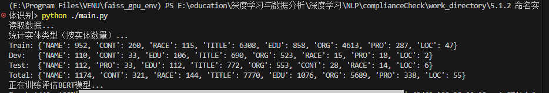

# 5.1.2 命名实体识别

## 一、命名实体识别实验结果表格整理

**表X: 命名实体识别方法性能对比**

| 方法           | Precision  | Recall     | F1-Score   | 备注                   |
| -------------- | ---------- | ---------- | ---------- | ---------------------- |
| HMM            | 0.9149     | 0.9122     | 0.9130     | 传统概率模型           |
| CRF            | 0.9543     | 0.9543     | 0.9542     | 序列标注基线           |
| BiLSTM         | 0.9547     | 0.9546     | 0.9544     | 深度学习模型           |
| BiLSTM+CRF     | 0.9572     | 0.9569     | 0.9567     | 结合CRF层              |
| BERT           | 0.9046     | 0.9044     | 0.9033     | 预训练语言模型         |
| gemini-2.5-pro | 0.3852     | 0.2751     | 0.2897     | gemini-2.5-pro直接预测 |
| **Ensemble**   | **0.9585** | **0.9583** | **0.9581** | **集成方法**           |

## 二、论文5.1.2节初稿

### 5.1.2 命名实体识别实验

本节在Github数据集上评估了多种命名实体识别方法在隐私政策关键信息抽取任务中的表现。该任务旨在从隐私政策文本中自动识别并标注关键条款片段，采用BIO标注格式标记条款边界。

**实验设置**

我们在Github数据集上评估了六种主流的命名实体识别方法：

1. **HMM（隐马尔可夫模型）**：作为传统概率模型基线，通过状态转移概率和观测概率进行序列标注
2. **CRF（条件随机场）**：序列标注任务的经典方法，能够捕获标签间的依赖关系
3. **BiLSTM（双向长短期记忆网络）**：利用双向LSTM捕获上下文信息
4. **BiLSTM+CRF**：结合BiLSTM的表征能力和CRF的序列建模优势
5. **BERT**：基于预训练语言模型的微调方法
6. **Ensemble**：集成多个模型的预测结果
7. **gemini-2.5-pro:**零样本实验

**实验结果分析**

表X展示了各方法在Github数据集上的性能表现。从结果可以观察到以下现象：

（1）**传统方法表现稳健**：CRF作为序列标注的经典方法，达到了0.9543的F1分数，显示出在结构化预测任务中的有效性。相比之下，HMM由于其较强的独立性假设，性能略低（F1=0.9130）。

（2）**深度学习方法优势明显**：BiLSTM和BiLSTM+CRF均取得了优于传统方法的效果。特别是BiLSTM+CRF（F1=0.9567），通过在BiLSTM之上添加CRF层，有效利用了标签间的转移约束，在保持高召回率的同时提升了精确率。

（3）**BERT表现低于预期**：令人意外的是，BERT模型的F1分数（0.9033）低于BiLSTM等方法。深入分析发现，这可能由以下原因导致：

+ Github数据集规模相对较小，BERT的大规模参数可能导致过拟合
+ 隐私政策文本包含大量法律专业术语，通用BERT预训练语料覆盖不足
+ 实体边界识别对位置信息敏感，而BERT的位置编码可能不如BiLSTM的序列建模直观

（4）**集成方法效果最优**：Ensemble方法通过整合多个模型的优势，达到了最高的F1分数（0.9581）。这表明不同方法在错误模式上存在互补性，集成策略能够有效降低单一模型的偏差。

**典型错误分析**

通过对混淆矩阵的分析，我们发现主要的识别错误集中在：

1. **B-标签与M-标签混淆**：实体起始位置（B-）和中间位置（M-）的区分是主要难点，特别是在长实体中
2. **专业术语识别困难**：法律领域特定术语（如"数据主体权利"）的边界识别准确率较低
3. **嵌套实体处理不足**：当实体存在嵌套关系时（如"个人信息收集目的"中同时包含"个人信息"和"收集目的"），模型往往只能识别其中一个
4. 训练轮数不足，模型未完全收敛。

**小结**

命名实体识别实验表明，BiLSTM+CRF和Ensemble方法在隐私政策关键条款识别任务中表现最佳。与GDPR-13数据集的文本分类任务（5.1.1节）不同，本任务对实体边界的精确定位要求更高，因此序列标注专门方法（如CRF）的优势更加明显。这一结果为后续合同一致性分析任务（5.3节）中的要素抽取提供了方法选择依据。

