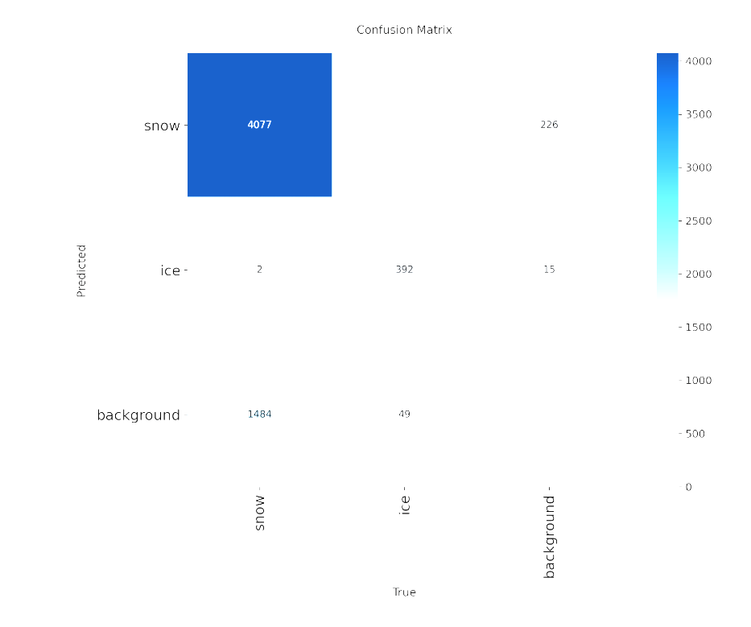
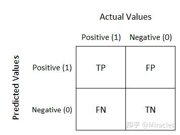

在分类任务（尤其是二分类）中，**P（精确率）**、**R（召回率）**、**F1（F1分数）** 是评估模型性能的核心指标，三者均基于**混淆矩阵**的4个基础指标计算：
- **TP（True Positive）**：真实为正类，模型预测为正类的样本数。
- **FP（False Positive）**：真实为负类，模型预测为正类的样本数（误报）。
- **TN（True Negative）**：真实为负类，模型预测为负类的样本数。
- **FN（False Negative）**：真实为正类，模型预测为负类的样本数（漏报）。

### 1. 精确率（Precision, P）
**核心含义**：模型预测为正类的样本中，**真实为正类**的比例。衡量模型“预测正类的准确性”，关注**减少误报**。

**计算公式**
$$
P = \frac{TP}{TP + FP}
$$

**示例**
垃圾邮件分类中，精确率高代表“模型标记的垃圾邮件里，真正是垃圾邮件的比例高”。

### 2. 召回率（Recall, R）
**核心含义**：真实为正类的样本中，**被模型预测为正类**的比例。衡量模型“识别正类的全面性”，关注**减少漏报**。

**计算公式**
$$
R = \frac{TP}{TP + FN}
$$

**示例**
疾病诊断中，召回率高代表“真正患病的人里，被模型检测出来的比例高”。

### 3. F1分数（F1-Score）
**核心含义**：精确率和召回率的**调和平均数**，综合衡量两者的表现，避免单一指标的片面性。F1越高，说明模型在精确率和召回率上的平衡越好。

**计算公式**
$$
F1 = \frac{2 \times P \times R}{P + R}
$$

将P和R的公式代入，可得到基于混淆矩阵的等价形式：
$$
F1 = \frac{2 \times TP}{2 \times TP + FP + FN}
$$

### 4. 多分类场景的扩展
在多分类任务中，需先对每个类别单独计算**该类别的P、R、F1**（将该类视为正类，其余所有类视为负类），再通过**宏平均、微平均、加权平均**等方式得到全局指标。

要理清**加权平均F1（Weighted-F1）**、**宏平均F1（Macro-F1）**、**微平均F1（Micro-F1）**的优缺点，核心是抓住三者对**类别权重**的分配逻辑差异，以下是分维度的详细对比分析：

### 一、 核心定义回顾
1.  **宏平均F1**
    对所有类别平等加权，先算每个类别的F1，再取算术平均：
    $$\text{Macro-F1}=\frac{1}{k}\sum_{i=1}^k F1_i$$
    其中 $k$ 是类别数，$F1_i$ 是第 $i$ 类的F1分数。

2.  **微平均F1**
    对全局样本加权，先汇总所有类别的 $TP/FP/FN$，再计算全局F1：
    $$\text{Micro-F1}=\frac{2\times TP_{total}}{2\times TP_{total}+FP_{total}+FN_{total}}$$

3.  **加权平均F1**
    以**各类别的样本数量**为权重，对每个类别的F1加权求和：
    $$\text{Weighted-F1}=\frac{1}{N}\sum_{i=1}^k N_i \times F1_i$$
    其中 $N_i$ 是第 $i$ 类的样本数，$N=\sum_{i=1}^k N_i$ 是总样本数。

### 二、 三者优缺点对比
| 指标           | 优点                                                         | 缺点                                                         |
| -------------- | ------------------------------------------------------------ | ------------------------------------------------------------ |
| **宏平均F1**   | 1. 平等对待所有类别，不偏袒样本多的类； 2. 能反映模型对**少数类**的识别能力； 3. 计算简单直观，结果易解释。 | 1. 类别不平衡时，少数类的F1波动会严重拉偏全局结果； 2. 完全忽略样本分布，无法反映模型在整体样本上的表现。 |
| **微平均F1**   | 1. 天然贴合样本分布，对整体预测准确程度的刻画更客观； 2. 类别不平衡场景下，结果更稳健； 3. 等价于多分类任务的**总体准确率**（当各类别预测独立时）。 | 1. 严重偏向样本量多的类别，少数类的预测效果会被“淹没”； 2. 无法体现模型对少数类的识别能力。 |
| **加权平均F1** | 1. 兼顾类别样本分布，权重分配更合理； 2. 比宏平均更贴合实际业务场景； 3. 比微平均更能兼顾少数类的表现（权重基于样本数，而非完全由全局样本主导）。 | 1. 样本极不平衡时，仍会偏向多数类； 2. 权重依赖真实样本分布，若样本分布有偏差，结果会失真； 3. 计算比宏平均稍复杂。 |

### 三、 适用场景总结
1.  **宏平均F1** → 适合**类别均衡**，或需要**重点关注少数类表现**的场景（如疾病诊断、异常检测）。
2.  **微平均F1** → 适合**类别严重不平衡**，且**更关注整体样本预测准确率**的场景（如垃圾邮件分类、商品标签预测）。
3.  **加权平均F1** → 适合**类别不平衡，但希望平衡多数类和少数类表现**的通用场景（如文本分类、图像多标签识别）。

